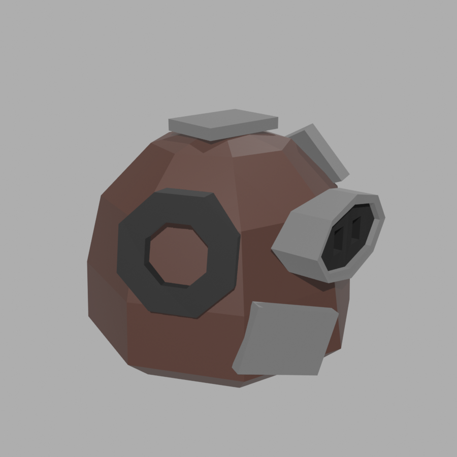
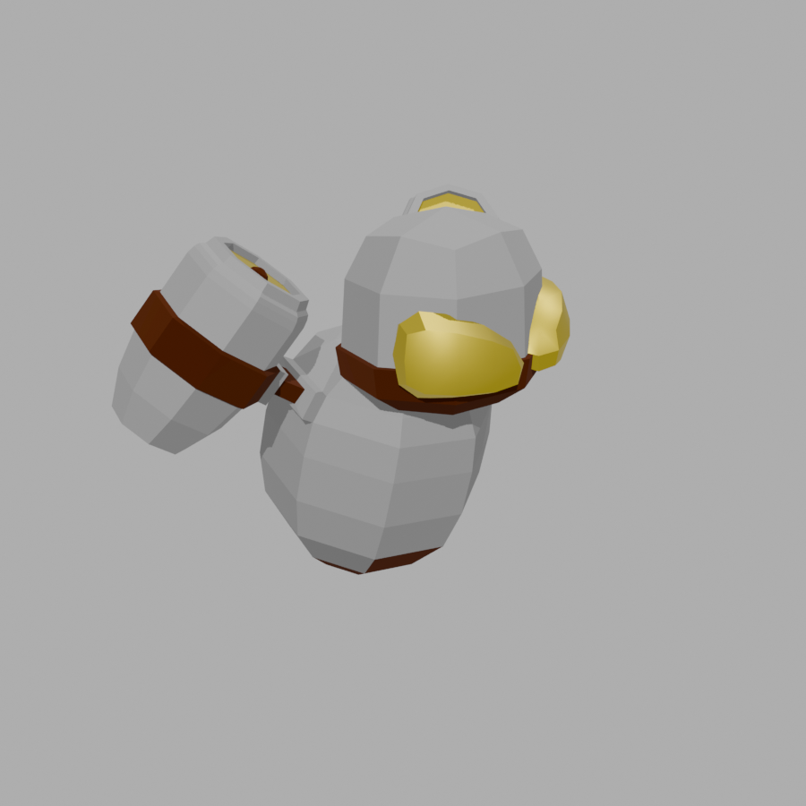
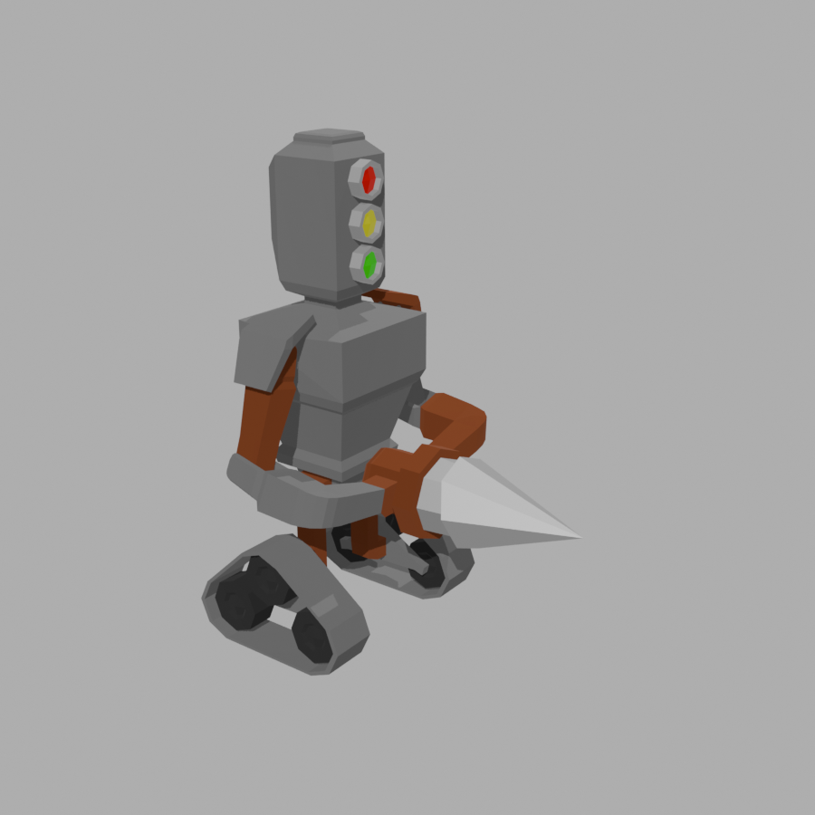
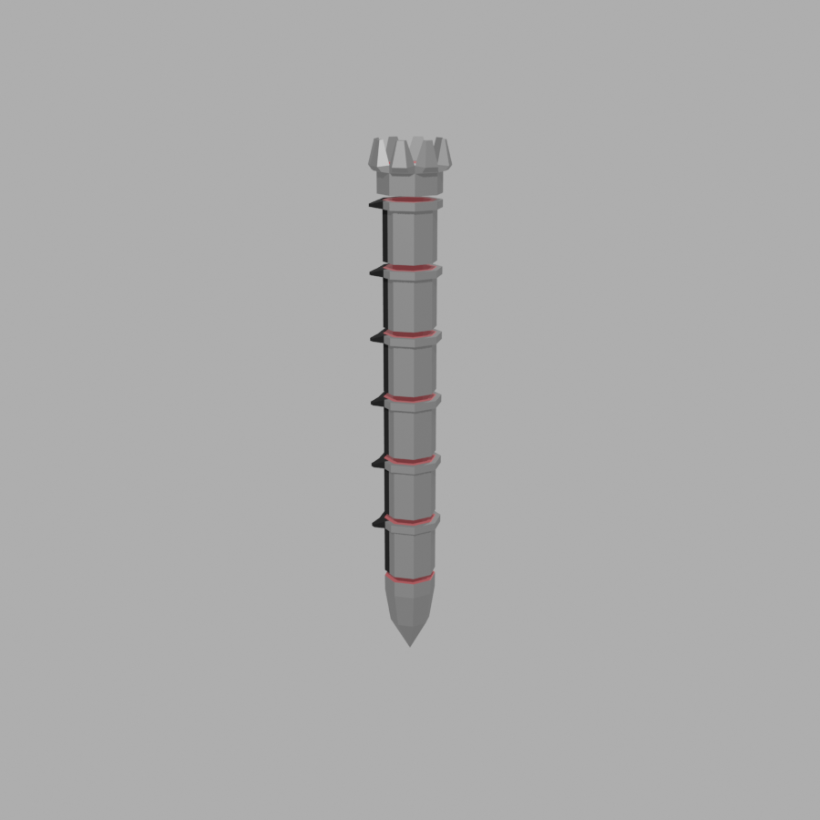
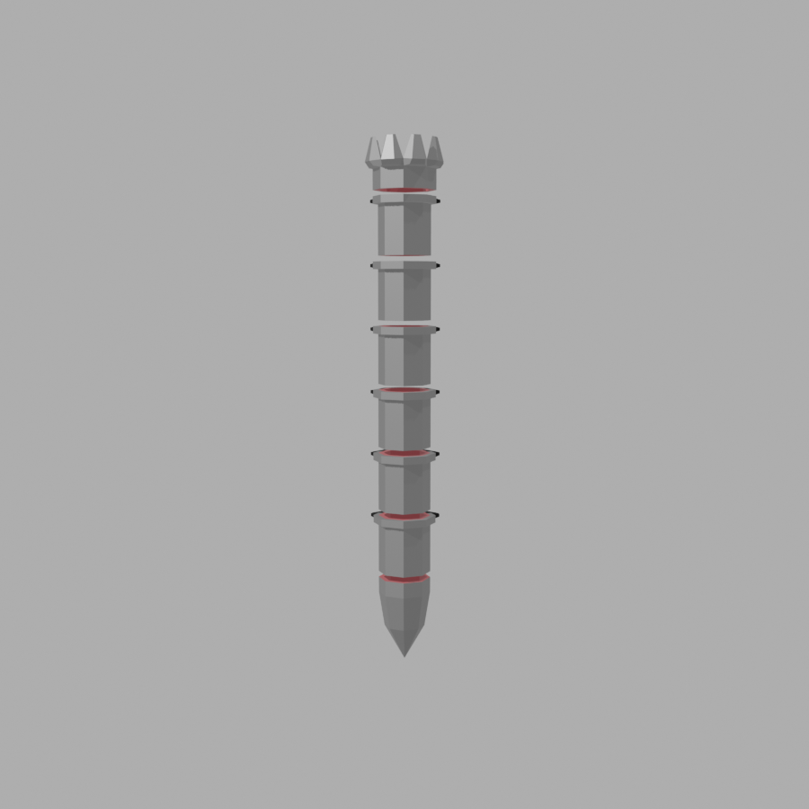

# Coherencia estética — scrap punk

Base visual sacada de `Personajes.blend` (Blender 4.5.3), el archivo abierto con los enemigos. Fecha de lectura: 28-09-2026. El archivo no se modificó ni se guardó.

El juego es un junkyard: chatarra, barro y máquinas armadas con piezas que no nacieron juntas. Estas cuatro mallas son la referencia para enemigos nuevos, UI, entorno y mapa. Si un asset nuevo no podría sentarse al lado de estas cuatro sin parecer de otro juego, no entra.

## Qué hay en el archivo

Cuatro mallas, una colección, cero texturas de imagen. El color es un Principled BSDF plano. Hay nodos de normal map, pero no tienen imagen conectada: el facetado de la geometría es el detalle.

| Objeto en el blend | Rol en la run | Vértices | Caras | Tamaño en mundo (X, Y, Z) |
|---|---|---|---|---|
| `Slime` | Junk Slime (`EnemyPro`) y familia slime | 178 | 178 | 1.23 × 0.98 × 1.30 |
| `Drone` | Vigilance Drone y familia drone | 534 | 532 | 1.16 × 1.52 × 1.96 |
| `Chaser` | Chaser Bot y familia chaser | 1273 | 1262 | 2.55 × 1.48 × 1.97 |
| `Stalker` | Boss. Malla modelada en horizontal y girada 90° en X para quedar de pie | 754 | 760 | 2.06 × 2.06 × 14.04 |

`Destroyer_Boss` no está en este archivo. Las variantes y elites (Hellfire, Bomber, Shocker) tampoco son otras mallas aquí: en el blend solo existen estos cuatro cuerpos. Un elite o una variante tiene que reconocerse como la misma silueta con otro acento o VFX, no como otro diseño.

Capturas de lectura (fondo gris neutro, no es el cielo del juego):

| Enemigo | Imagen |
|---|---|
| Slime |  |
| Drone |  |
| Chaser |  |
| Stalker |  |
| Stalker, perfil |  |

## Fichas

Los hex son el color base del shader pasado de lineal a sRGB, para usarlos en UI y en conceptos. Metallic y roughness son los valores del Principled, sin convertir. El porcentaje es área de la malla, no cantidad de caras.

### Slime

Bola de barro facetada, del tamaño de un enemigo común. No es un slime verde de fantasía: el cuerpo es tierra oscura.

Piezas pegadas, y no hacen juego entre sí:

- Un anillo octogonal de goma negra, como una arandela o un ojo de buey.
- Un hocico de chapa con dos agujeros negros. El otro "ojo" no se le parece.
- Placas grises sueltas arriba y a un costado, como parches de latón.

| Material | Área | Hex | Metallic | Roughness | Para qué sirve |
|---|---|---|---|---|---|
| Tierra.001 | 63 % | `#422821` | 0 | 0.50 | Cuerpo de barro |
| Metal.001 | 18 % | `#747474` | 0.50 | 0.41 | Placas y hocico |
| Goma.001 | 8 % | `#101010` | 0 | 0.72 | Anillo |
| Goma.003 | 8 % | `#101010` | 0 | 0.72 | Segunda pieza de goma |
| Negro.001 | 1.5 % | `#000000` | 0 | 1.00 | Agujeros |
| Luz Roja.001 | 0.2 % | `#E71D23` | 0 | 0.00 | Punto rojo. Emission en 0: es pintura brillante, no una luz |

Lectura a distancia: mancha marrón con chatarra gris. El rojo casi no existe en la superficie.

### Drone

Vaina de dos bulbos apilados, gris claro, con un tanque colgando de un solo lado. Se lee como chatarra que flota, no como un drone militar.

- Visor y tapa superior en amarillo mostaza metálico. Es el color de familia, no una luz.
- Cincho y franja del tanque en óxido oscuro.
- El interior del cañón del tanque repite el mismo amarillo.

| Material | Área | Hex | Metallic | Roughness | Para qué sirve |
|---|---|---|---|---|---|
| Metal.002 | 52 % | `#ABABAB` | 1.00 | 0.86 | Cuerpo |
| Amarillo.002 | 25 % | `#D0BD2F` | 1.00 | 0.55 | Visor, tapa, boca del tanque |
| Oxido.002 | 24 % | `#642E0D` | 1.00 | 1.00 | Cincho y franja |

El amarillo aquí sí ocupa un cuarto del cuerpo. Es la excepción de la paleta: identifica a la familia drone. Sigue siendo metal gastado (roughness 0.55), no pintura de auto nuevo.

### Chaser

Cuerpo de caja gris sobre orugas. La cabeza es un semáforo de tres luces. Los brazos son óxido. En las manos lleva un cono de metal más claro, la punta con la que embiste.

| Material | Área | Hex | Metallic | Roughness | Para qué sirve |
|---|---|---|---|---|---|
| Metal | 60 % | `#7E7E7E` | 1.00 | 0.89 | Torso, cabeza, orugas por fuera |
| Oxido | 21 % | `#8C5032` | 1.00 | 1.00 | Brazos y juntas |
| Rueda | 11 % | `#070707` | 0 | 0.88 | Rodillos y huecos de la oruga |
| Metal Brillante | 7 % | `#B2B2B2` | 1.00 | 0.64 | Cono |
| Verde | 0.1 % | `#07E700` | 1.00 | 0.50 | Luz inferior |
| Amarillo | 0.1 % | `#E5E707` | 1.00 | 0.50 | Luz del medio |
| Rojo | 0.1 % | `#E70007` | 1.00 | 0.50 | Luz superior |

El semáforo es la frase visual del personaje y casi no pesa en área. Rojo, amarillo y verde son señales de estado, no el color del robot.

### Stalker

Columna de tubo facetado, unos 14 de alto y 2 de ancho. La punta es una broca. Arriba, una corona de dientes. Entre segmento y segmento hay una junta roja oscura (el material se llama Estómago: es carne o fluido, no pintura). De un solo lado salen aletas negras de goma. El otro lado es tubo liso.

| Material | Área | Hex | Metallic | Roughness | Para qué sirve |
|---|---|---|---|---|---|
| Metal.003 | 41 % | `#8B8B8B` | 0.77 | 0.50 | Segmentos |
| Estomago.001 | 41 % | `#9D3F48` | 0 | 0.50 | Juntas internas |
| Goma.002 | 18 % | `#000000` | 0.20 | 0.89 | Aletas |
| Material.001 | 0.6 % | `#ECECEC` | 0.64 | 0.50 | Dientes de la corona |

El boss no tiene más densidad que el Chaser (754 vértices contra 1273). Crece repitiendo el mismo tubo. La amenaza se lee por proporción, no por detalle.

## Paleta

Cuatro familias. Todo asset nuevo usa estas y, como mucho, un acento de la lista de señales.

| Familia | Hex de referencia | Cómo se comporta |
|---|---|---|
| Barro | `#422821` | Mate. Cuerpo orgánico y suelo. Nunca verde lima. |
| Metal gastado | `#7E7E7E` cuerpo, `#ABABAB` chapa clara, `#B2B2B2` filo, `#747474` parche | Metallic alto, roughness 0.4–0.9. Gris, no plateado de espejo. |
| Óxido | `#642E0D` oscuro, `#8C5032` de brazo | Metallic 1, roughness 1. Vive en juntas, cinchos y miembros, no en el bloque principal. |
| Goma | `#000000`–`#101010` | Mate. Agujeros, orugas, anillos, aletas. |

Acentos, y solo como señal o como marca de familia:

| Señal | Hex | Dónde ya existe |
|---|---|---|
| Mostaza | `#D0BD2F` | Familia drone. Puede cubrir un panel. |
| Rojo señal | `#E71D23` / `#E70007` | Punto o luz de semáforo. Superficie mínima. |
| Amarillo señal | `#E5E707` | Luz de semáforo. |
| Verde señal | `#07E700` | Luz de semáforo. |
| Rojo interno | `#9D3F48` | Juntas, tripas, fluido. No es el rojo de alarma. |

Ningún material del archivo tiene emission por encima de 0. El scrap punk de este juego no brilla. El rojo "Luz" es roughness 0 sobre un color saturado: un plástico brillante, no un neón.

## Reglas

1. **Una silueta, leída sin color.** Bola, vaina con tanque, semáforo sobre orugas, broca vertical. Si hace falta el color para saber qué es, la forma falló.
2. **Densidad baja.** Un común cabe entre ~180 y ~1300 vértices. Un boss puede ser más largo. No puede ser más denso solo por ser boss: se alarga repitiendo módulos.
3. **Piezas que no nacieron juntas.** Ojos distintos, un tanque de un solo lado, aletas de un solo lado, placas pegadas encima. La simetría de fábrica queda para el metal nuevo, y este mundo ya no tiene metal nuevo.
4. **El color saturado es una señal.** Semáforo, punto rojo, junta interna. En área, por debajo del 5 %, salvo el mostaza del drone, que es la marca de esa familia y puede llegar a un panel (~25 %).
5. **El cuerpo es barro, gris o los dos.** El óxido mancha juntas y extremidades. No pinta el bloque entero.
6. **Metal gastado, no cromo.** Metallic alto con roughness alta. La faceta hace el brillo. No hay mapa de suciedad pintado: la suciedad es otro material en otra isla de caras.
7. **Sin neón y sin textura pintada.** Emission en 0. Sin imágenes en los materiales. El detalle se modela (anillo, placa, diente, oruga) o no existe.
8. **Variante = misma silueta.** Hellfire, Bomber y Shocker no traen otra malla en este archivo. Si se diferencian, es con el acento de familia, el VFX y la animación.

### Enemigos nuevos

- Partir de una de las cuatro siluetas, o de una igual de simple (una caja, un tubo, una bolsa).
- Añadir dos o tres piezas de otra familia de material, colocadas mal a propósito.
- Un solo acento de la tabla de señales, chico, en la parte que explica el comportamiento (boca, punta, ojo, depósito).
- Un elite agranda o ensucia al mismo cuerpo. No le cambia la especie.

### Entorno y mapa

- El suelo es barro `#422821`. Lo construido es tubo y chapa repetidos, como los segmentos del Stalker.
- El óxido va en juntas, soldaduras y patas. El centro de un muro puede quedarse en gris gastado.
- El mostaza `#D0BD2F` marca precaución o familia drone: una franja, un panel, un depósito. No un edificio entero.
- Un punto de interés del mapa usa el mismo truco que el semáforo: una señal chica sobre una masa gris o marrón. El mapa se lee por masas, no por colores de equipo.
- Las piezas grandes se repiten. Un vertedero creíble aquí es el mismo tubo siete veces, no siete props únicos.

### UI

- Paneles como chapas: gris `#7E7E7E` o `#ABABAB`, borde oscuro de goma, algún remache. El fondo de pantalla puede ir a barro.
- Rojo, amarillo y verde solo dicen estado, en ese orden de semáforo: peligro, aviso, listo. No decoran marcos.
- El mostaza identifica lo que pertenece al mundo drone o a una advertencia de chatarra. No es el color de "raro" ni de "épico".
- Iconos gruesos, de pocas formas, con la misma lógica de silueta. Un icono con gradiente neón o con cian/magenta es de otro juego.
- Tipografía y marcos pueden ser duros y cortados. No hace falta simular óxido con una textura: un bloque de color plano ya está en el idioma de los modelos.

## Qué dejar fuera

- Blanco clínico, cromo pulido, hologramas, cian, magenta, violeta neón.
- Slimes verdes, drones blancos de sci-fi, robots simétricos de catálogo.
- Suciedad dibujada en una textura cuando se puede separar en dos materiales.
- Un boss con el doble de piezas distintas. El Stalker demuestra que el tamaño sale de repetir el tubo.
- Glow como sustituto de lectura. Si la silueta no se entiende en gris, el brillo no la arregla.
