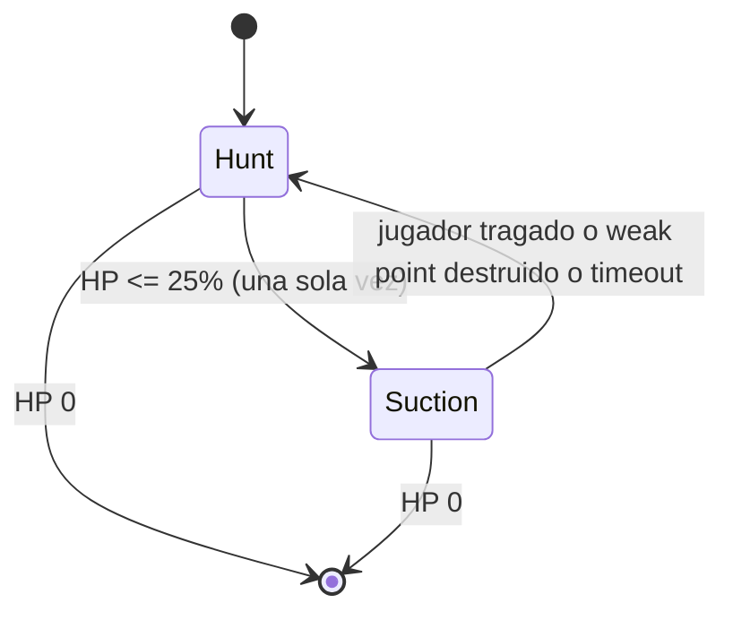

# Boss Destroyer

Segundo boss de Overheat, jugable con prefab placeholder (sin arte final). Reemplaza el slot de
`Boss_2` en `BossManager._secondBossPrefab`: aparece en **Overheat 4, 8, 12…**, alternando con
GigaWorm en Overheat 2, 6, 10… (`BossManager.SelectBossPrefabForCurrentCycle`).

## Diseño de combate

- **Hunt:** camina lento hacia el jugador (`EnemyFollow`) y dispara misiles seeking con
  cooldown desde `MissileMuzzle`.
- **Suction (una única vez, al caer a ≤25% de vida):** se queda quieto, invencibilidad
  **total** (bloquea también DoT), activa el weak point de la boca, succiona al jugador y al
  swarm hacia `Mouth`, come enemigos (cura) y espera a que el jugador llegue a la boca o le
  rompan el weak point. Timeout de seguridad de 15s por si nada de eso ocurre (evita softlock).
  Tras terminar la succión no vuelve a dispararse (no hay una segunda succión al 50%/10% etc.).
- **Fin de succión — jugador tragado:** daño alto + knockback lejos de la boca + cura grande al
  boss → vuelve a Hunt.
- **Fin de succión — weak point destruido:** quita la invencibilidad, daño masivo al cuerpo →
  vuelve a Hunt.

**Nota de balance sobre el umbral 25%:** con el trigger tan bajo, la mayor parte de la pelea
transcurre en Hunt esquivando misiles, y la succión llega casi al final del combate. Vale la
pena confirmar en playtest si el cierre de la pelea se siente largo (mucho Hunt post-succión) y,
si hace falta, escalar cadencia/daño de misiles con el tiempo.

## Scripts nuevos

| Archivo | Rol |
|---|---|
| `Assets/Scripts/Enemy/Behaviors/DestroyerBehavior.cs` | Máquina de estados Hunt/Suction. |
| `Assets/Scripts/Enemy/Behaviors/DestroyerMouthWeakPoint.cs` | `IDamageable` propio del weak point de la boca (antes solo existía por nombre; ahora el daño se resuelve ahí, no en el `EnemyHealth` del cuerpo). |
| `Assets/Scripts/Enemy/Behaviors/EnemySeekingMissile.cs` | Misil que gira hacia el jugador cada `FixedUpdate` (a diferencia de `EnemyProjectile`, que va recto). Sin pool: cadencia baja, instancia/destruye directo. |
| `Assets/Scripts/Enemy/Editor/DestroyerPrefabMenu.cs` | Menús de editor para generar los prefabs placeholder (ver abajo). |

### Extensiones a scripts existentes

| Archivo | Cambio |
|---|---|
| `PlayerMovement.cs` / `PlayerCombatHooks.cs` | `ApplyPull` / `TryPull(targetPoint, acceleration)`: tira al jugador con aceleración continua, reutilizando la ventana de knockback (`_knockbackTimer`) para no ser recortado por el speed-cap normal. Se llama cada frame mientras dura la succión. |
| `EnemyHealth.cs` | `Heal(int)` (nuevo). `SetInvincible(bool, bool blockDot = false)`: con `blockDot: true` la invencibilidad también bloquea `ApplyDotDamage` (antes el DoT siempre pasaba, sin importar la invencibilidad). Destroyer en succión usa inmunidad total. |
| `EnemyRegistry.cs` | `CollectActive(List<Transform>)`: copia todos los enemigos activos sin alocar, para succionar el swarm completo. |

## Prefabs (menú `ScrapWaves/Enemies/`)

Los prefabs se generan con menús de editor (no YAML a mano), mismo patrón que
`EconomySceneSetupMenu`. Correr en Unity Editor, en este orden:

1. **`ScrapWaves/Enemies/Create Destroyer Prefab`** — parte de `Assets/Prefabs/Boss_2.prefab`
   (instancia desconectada, no modifica el original), quita `SwarmPooledEnemy` si tuviera,
   ajusta `EnemyFollow._moveSpeed` a 1.6, agrega hijos placeholder `Mouth`, `WeakPoint`
   (collider esférico no-trigger + `DestroyerMouthWeakPoint`, inicia desactivado) y
   `MissileMuzzle`, agrega `DestroyerBehavior` y cablea sus referencias. Llama internamente a
   `Create Destroyer Missile Prefab` si `DestroyerMissile.prefab` todavía no existe. Guarda en
   `Assets/Prefabs/Destroyer_Boss.prefab`.
   - Las posiciones locales de `Mouth`/`WeakPoint`/`MissileMuzzle` son un placeholder (mismo
     punto, delante del cuerpo) — reposicionar a mano una vez que haya arte real.
2. **`ScrapWaves/Enemies/Assign Destroyer As Second Boss In Scene`** — con la escena abierta
   (`GameplayScene`, luego `SampleScene`), busca el `BossManager` de la escena y asigna
   `_secondBossPrefab` = `Destroyer_Boss`. Recordar guardar la escena después.

Todos los números de combate (daño, velocidades, radios, porcentajes de cura) quedan expuestos
en el Inspector de `DestroyerBehavior` para ajuste de diseño sin tocar código.

### Defaults del Inspector

| Grupo | Campo | Default |
|---|---|---|
| Fase | Umbral de succión | 25% de vida |
| Misiles (Hunt) | Intervalo / daño / velocidad / giro | 1.2s / 12 / 10 u/s / 90°/s |
| Succión | Aceleración de pull al jugador | 14 |
| Succión | Velocidad de pull al swarm | 6 u/s |
| Comer swarm | Radio de comer / cura por enemigo | 2.5 / 2% de MaxHealth |
| Tragar jugador | Radio / daño / knockback / cura | 2.2 / 40 / 35 / 15% de MaxHealth |
| Weak point | Vida / daño al cuerpo al romperse | 80 / 20% de MaxHealth |
| Seguridad | Timeout máximo de succión | 15s |

## Playtest mínimo

1. Overheat 2 = GigaWorm; Overheat 4 = Destroyer.
2. Hunt: camina lento y dispara misiles que curvan hacia el jugador.
3. Bajar al boss a ≤25% de vida: se detiene, queda inmune (incluso a DoT), succiona swarm y
   jugador hacia la boca.
4. Comer slimes/enemigos del swarm cura al Destroyer.
5. Dejarse llevar hasta la boca: daño alto + knockback + cura grande al boss + vuelve a Hunt
   (misiles).
6. En otra run: en vez de llegar a la boca, romper el `WeakPoint` a tiros → daño masivo al
   cuerpo + fin de la inmunidad + vuelve a Hunt.
7. Confirmar que tras una succión no se repite al bajar más HP (no hay segunda succión).
8. Dejar pasar los 15s sin llegar a la boca ni romper el weak point → confirmar que corta sola
   (timeout) y no queda colgado el Overheat.

### Atajos de QA útiles para este playtest

No hay un atajo para saltar directo a Overheat 4; los existentes que ayudan a iterar son:

- **Numpad 0** — vida infinita del jugador (`DebugInfiniteHealth`), útil para pasar los pasos 5
  y 6 sin morir mientras se ajustan números.
- **F3** — panel de QA de core loop (`QaCoreLoopMenu`): cadencia/tope del spawner orbital y
  pesos de la ruleta, para acelerar cuánto swarm hay disponible para probar la succión.
