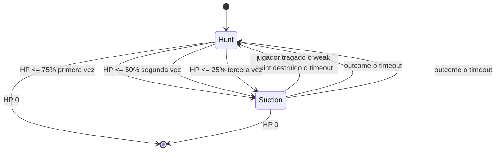

# Boss Destroyer

Segundo boss de Overheat, jugable con prefab placeholder (sin arte final). Reemplaza el slot de
`Boss_2` en `BossManager._secondBossPrefab`: aparece en **Overheat 4, 8, 12…**, alternando con
GigaWorm en Overheat 2, 6, 10… (`BossManager.SelectBossPrefabForCurrentCycle`).

## Diseño de combate

- **Hunt:** camina lento hacia el jugador (`EnemyFollow`) y dispara misiles seeking con
  cooldown desde `MissileMuzzle`.
- **Suction (3 veces por pelea):** se dispara al cruzar cada umbral de vida **75% → 50% → 25%**
  (cada umbral se consume una sola vez, aunque el boss se cure después). Se queda quieto,
  invencibilidad **total** (bloquea también DoT), activa el weak point de la boca, succiona al
  jugador y al swarm hacia `Mouth`, come enemigos (cura) y espera a que el jugador llegue a la
  boca o le rompan el weak point. Timeout de seguridad de 15s por si nada de eso ocurre (evita
  softlock). Tras terminar vuelve a Hunt con misiles hasta el siguiente umbral no consumido.
- **Fin de succión — jugador tragado:** daño alto + knockback lejos de la boca + cura grande al
  boss → vuelve a Hunt.
- **Fin de succión — weak point destruido:** quita la invencibilidad, daño masivo al cuerpo →
  vuelve a Hunt.
- **Fin de succión — timeout:** vuelve a Hunt sin bonus; el umbral ya quedó consumido.

**Nota:** si un golpe baja la vida de 80% a 45% en un solo frame, solo entra la succión del
umbral 75% (no se encadenan dos succiones en el mismo frame).

## Scripts nuevos

| Archivo | Rol |
|---|---|
| `Assets/Scripts/Enemy/Behaviors/DestroyerBehavior.cs` | Máquina de estados Hunt/Suction con 3 umbrales. |
| `Assets/Scripts/Enemy/Behaviors/DestroyerMouthWeakPoint.cs` | `IDamageable` propio del weak point de la boca. |
| `Assets/Scripts/Enemy/Behaviors/EnemySeekingMissile.cs` | Misil que gira hacia el jugador cada `FixedUpdate`. |
| `Assets/Scripts/Enemy/Editor/DestroyerPrefabMenu.cs` | Menús de editor para generar los prefabs placeholder. |

### Extensiones a scripts existentes

| Archivo | Cambio |
|---|---|
| `PlayerMovement.cs` / `PlayerCombatHooks.cs` | `ApplyPull` / `TryPull` para succión continua. |
| `EnemyHealth.cs` | `Heal(int)`; `SetInvincible(bool, blockDot)` bloquea DoT en succión. |
| `EnemyRegistry.cs` | `CollectActive` para succionar el swarm. |

## Prefabs (menú `ScrapWaves/Enemies/`)

1. **`ScrapWaves/Enemies/Create Destroyer Prefab`** → `Assets/Prefabs/Destroyer_Boss.prefab`
2. **`ScrapWaves/Enemies/Assign Destroyer As Second Boss In Scene`** → asigna `_secondBossPrefab`

### Defaults del Inspector

| Grupo | Campo | Default |
|---|---|---|
| Fase | Umbrales de succión | 75%, 50%, 25% (array en orden descendente) |
| Misiles (Hunt) | Intervalo / daño / velocidad / giro | 1.2s / 12 / 10 u/s / 90°/s |
| Succión | Aceleración de pull al jugador | 14 |
| Succión | Velocidad de pull al swarm | 6 u/s |
| Comer swarm | Radio de comer / cura por enemigo | 2.5 / 2% de MaxHealth |
| Tragar jugador | Radio / daño / knockback / cura | 2.2 / 40 / 35 / 15% de MaxHealth |
| Weak point | Vida / daño al cuerpo al romperse | 80 / 20% de MaxHealth |
| Seguridad | Timeout máximo de succión | 15s |

## Playtest mínimo

1. Overheat 2 = GigaWorm; Overheat 4 = Destroyer.
2. Hunt: camina lento y dispara misiles que curvan hacia el jugador.
3. Bajar al boss a **≤75%** de vida: 1.ª succión (inmune, pull, weak point activo).
4. Resolver (boca, weak point o timeout) → vuelve a Hunt con misiles.
5. Bajar a **≤50%** → 2.ª succión (mismo flujo).
6. Bajar a **≤25%** → 3.ª succión (última).
7. Confirmar que **no** hay 4.ª succión aunque el boss se cure y siga vivo.
8. Comer slimes durante succión cura al Destroyer.
9. Dejarse llevar hasta la boca: daño alto + knockback + cura grande + vuelve a Hunt.
10. En otra run: romper el `WeakPoint` a tiros → daño masivo al cuerpo + fin de inmunidad.

### Atajos de QA útiles

- **Numpad 0** — vida infinita del jugador (`DebugInfiniteHealth`).
- **F3** — panel QA de core loop (`QaCoreLoopMenu`): más swarm para probar succión.
